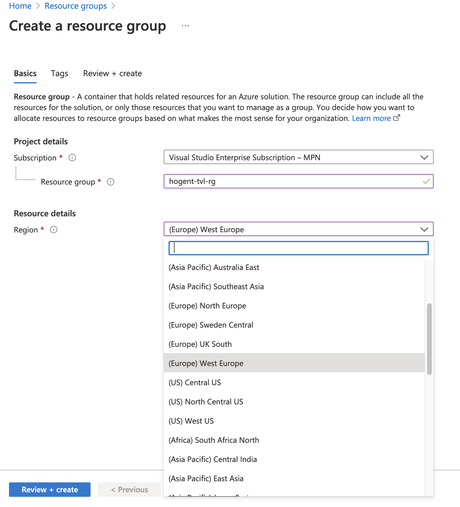
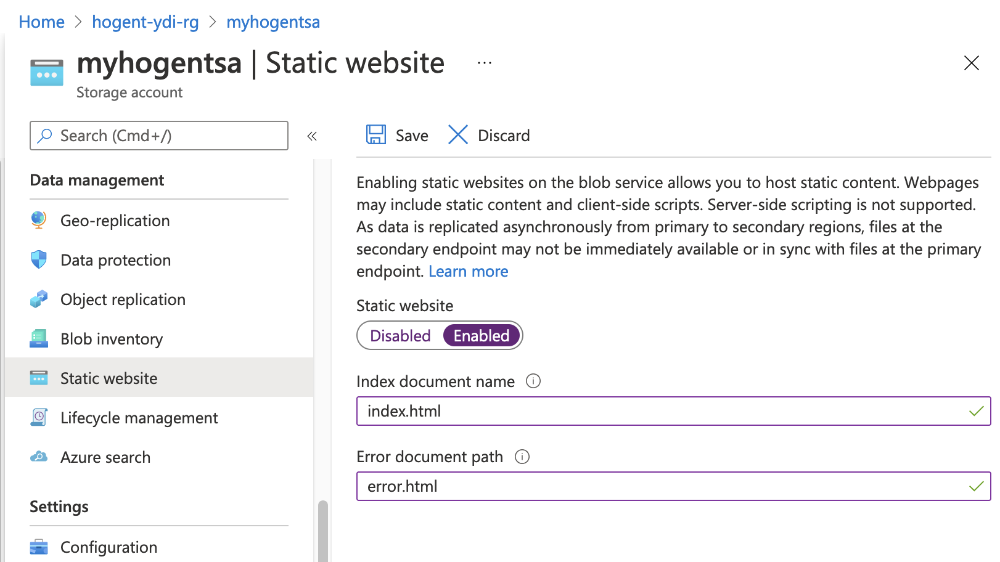
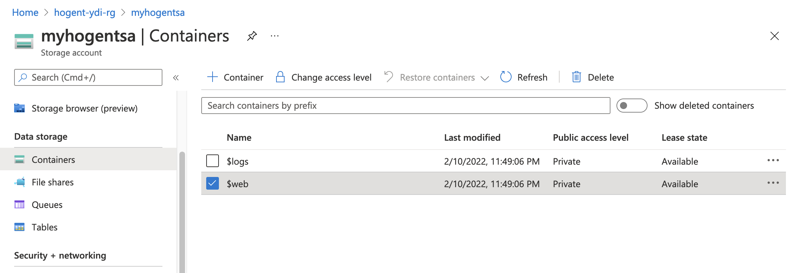
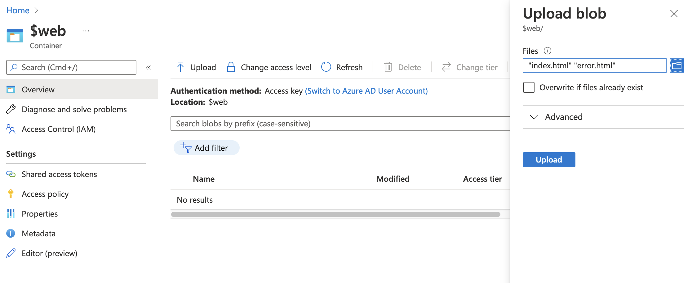
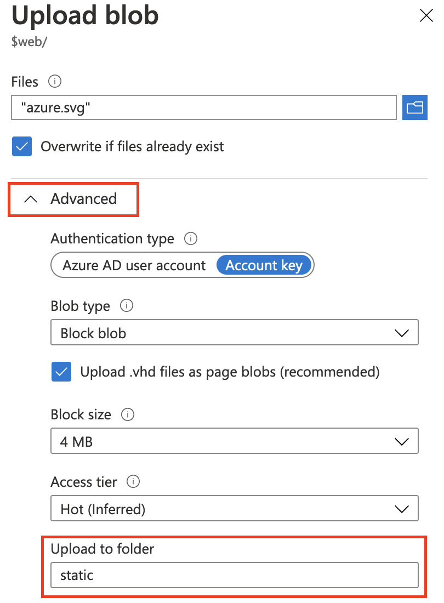
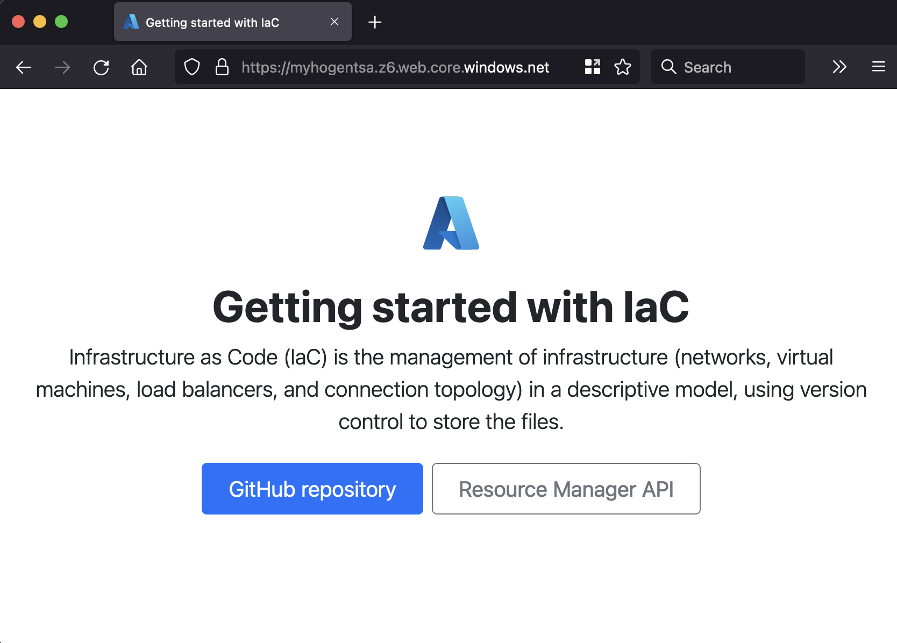
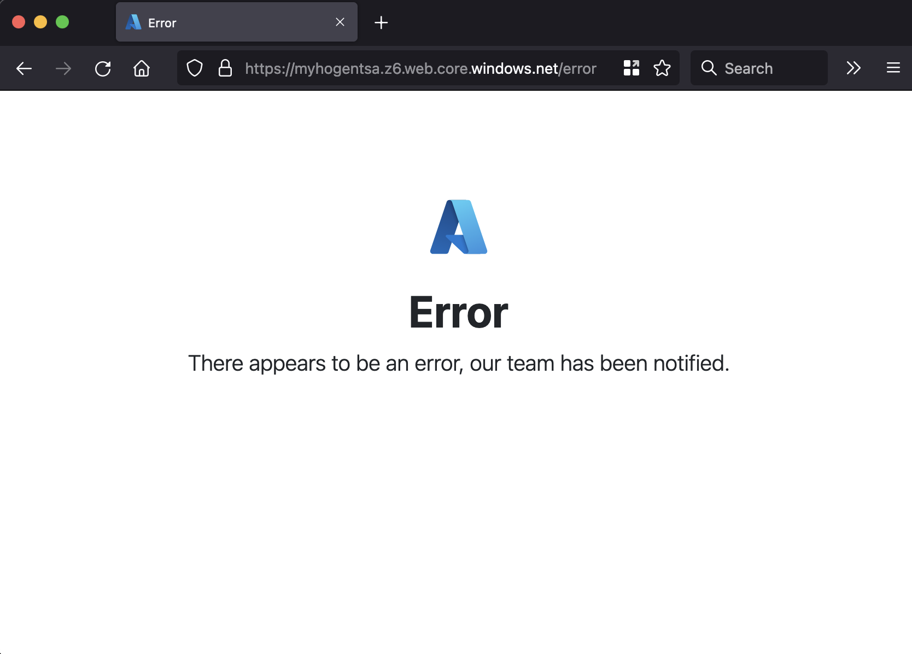

# Module 2: Infrastructure in Cloud

## Getting started

1. 💌 Send your mail-adres to **yannick.dils@xylos.com**
2. ⏰ Wait for the invitation in your mailbox
3. 🚀 Login to https://portal.azure.com

## Portal actions

1. Create a resource group in the **west europe** region named hogent-(your name initials)-rg
    1. ***Example: hogent-ydi-rg***
       
1. From the newly created resource group, click the "Create" button.
1. In the "Create a resource" tab and select (or search) "Storage Account". 
1. In the creation tab, ensure that you deploy the Storage Account in the "**West Europe**" region. Check that your previously created resource group is selected as the target resource group.
  

## Enabling static website hosting in Azure Storage

You can serve static content (HTML, CSS, JavaScript, and image files) directly from a storage container named ```$web```. Hosting your content in Azure Storage enables you to use serverless architectures that include Azure Functions and other Platform as a service (PaaS) services. Azure Storage static website hosting is a great option in cases where you don't require a web server to render content.

1. Open the newly created storage account.
2. In the left blade, scroll to the **Data management**.
3. Select the **Static website** option.

To enable static website hosting, select the name of your default file, and then optionally provide a path to a custom 404 page.

4. To enable the static website hosting, select the "**Enabled**" option.
5. Set the index document name to "**index.html**"
6. Error document path to "**error.html**"
7. Hit the "**save**" button



## Deploying static website files

If a blob storage container named $web doesn't already exist in the account, one is created for you. Add the files of your site to this container.

1. In the left blade, scroll to "**Data storage**"
2. Select the" **Containers**" option.
3. You will be presented with a list of all available containers, select the ```$web``` container.



4. Click the "**Upload**" button.
5. Upload the ```index.html``` and ```error.html``` files in the [simple-static-site](simple-static-site/) folder.



6. Click the "**Upload**" button once more.
7. Select the ```azure.svg``` file in the simple-static-site's [static](simple-static-site/static) folder.
8. Before submitting the file upload, open the "**advanced**" option.
9. Set the "**Upload to folder**" to "**static**", be careful because this is case-sensitive



## Browsing your static website

1. In the left blade, scroll to the **Data management**.
2. Select the **Static website** option.
3. Copy the Primary endpoint URL and open the link in a new browser tab.



4. Browsing to a URL that does not exist you will see that you are presented with the error page.



