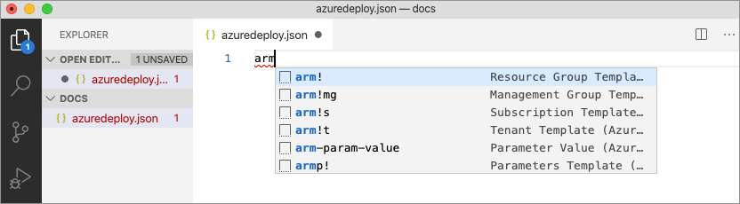
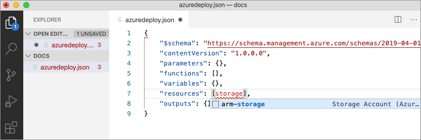
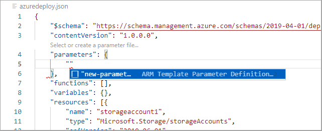

# Module 4: ARM Deep Dive

## Exercise: Create and deploy Azure Resource Manager templates by using Visual Studio Code

In this exercise you will learn how to use Visual Studio Code, and the Azure Resource Manager Tools extension, to create and edit Azure Resource Manager templates.

- Create an Azure Resource Manager template
- Add an Azure resource to the template
- Add parameters to the template
- Create a parameter file
- Deploy the template
- Clean up resources

### Prerequisites

- An Azure account with an active subscription. If you don't already have one, ask your instructor.
- [Visual Studio Code](https://code.visualstudio.com/) with the [Azure Resource Manager Tools](https://marketplace.visualstudio.com/items?itemName=msazurermtools.azurerm-vscode-tools) installed.
- [Azure CLI](https://docs.microsoft.com/en-us/cli/azure/) installed locally

## Useful links
- [Azure ARM Syntax](https://docs.microsoft.com/en-us/azure/azure-resource-manager/templates/syntax)
- [Azure ARM Resource definitions](https://docs.microsoft.com/en-us/azure/templates/)

### Create an Azure Resource Manager template

Create and open a new file named azuredeploy.json with Visual Studio Code.

1. Enter arm in the azuredeploy.json file and select arm! from the autocomplete options. This will insert a snippet with the basic building blocks for an Azure resource group deployment.



Your file should contain something similar to the example below.

```JSON

{
    "$schema": "<https://schema.management.azure.com/schemas/2019-04-01/deploymentTemplate.json>#",
    "contentVersion": "1.0.0.0",
    "parameters": {},
    "functions": [],
    "variables": {},
    "resources": [],
    "outputs": {}
}
```

### Add an Azure resource to the template

In this section you will add a snippet to support the creation of an Azure storage account to the template.

Place the cursor in the template resources block, type in storage, and select the arm-storage snippet.

.

The ```resources``` block should look similar to the example below.

```JSON
"resources": [{
    "name": "storageaccount1",
    "type": "Microsoft.Storage/storageAccounts",
    "apiVersion": "2019-06-01",
    "tags": {
        "displayName": "storageaccount1"
    },
    "location": "[resourceGroup().location]",
    "kind": "StorageV2",
    "sku": {
        "name": "Premium_LRS",
        "tier": "Premium"
    }
}],
```

### Add parameters to the template

Now you will create and use a parameter to specify the storage account name.

Place your cursor in the parameters block, add a carriage return, type ```"```, and then select the ```new-parameter``` snippet. This action adds a generic parameter to the template.



Make the following changes to the new parameter you just added:

1. Update the name of the parameter to ```storageAccountName``` and the description to ```Storage Account Name```.

1. Azure storage account names have a minimum length of 3 characters and a maximum of 24. Add both minLength and maxLength to the parameter and provide appropriate values.

The ```parameters``` block should look similar to the example below.

```JSON
"parameters": {
    "storageAccountName": {
        "type": "string",
        "metadata": {
            "description": "Storage Account Name"
        },
        "minLength": 3,
        "maxLength": 24
    }
},
```

Follow the steps below to update the name property of the storage resource to use the parameter.

1. In the ```resources``` block, delete the current default name which is ```storageaccount1``` in the examples above. Leave the quotes (```""```) around the name in place.1.
1. Enter a square bracket ```[```, which produces a list of Azure Resource Manager template functions. Select parameters from the list.1.
1. Enter a single quote ```'``` inside of the round brackets produces a list of all parameters defined in the template and select storageAccountName.

The resources block of the template should now be similar to the example below.

```JSON

"resources": [{
    "name": "[parameters('storageAccountName')]",
    "type": "Microsoft.Storage/storageAccounts",
    "apiVersion": "2019-06-01",
    "tags": {
        "displayName": "storageaccount1"
    },
    "location": "[resourceGroup().location]",
    "kind": "StorageV2",
    "sku": {
        "name": "Premium_LRS",
        "tier": "Premium"
    }
}],
```

### Create a parameter file

An Azure Resource Manager template parameter file allows you to store environment-specific parameter values and pass these values in as a group at deployment time. This useful if you want to have values specific to a test or production environment, for example. The extension makes it easy to create a parameter file that is mapped to your existing template. Follow the steps below to create a parameter file.

1. With the azuredeploy.json file in focus open the Command Palette by selecting View > Command Palette from the menu bar.

1.In the Command Palette enter "parameter" in the search bar and select Azure Resource Manager Tools:Select/Create Parameter File.


1. A new dialog box will open at the top of the editor. From those options select New, then select All Parameters. Accept the default name for the new file.1.
1. Edit the ```value``` parameter and type in a name that meets the naming requirements. The azuredeploy.parameters.json file should be similar to the example below.

```JSON
{
    "$schema": "<https://schema.management.azure.com/schemas/2019-04-01/deploymentParameters.json>#",
    "contentVersion": "1.0.0.0",
    "parameters": {
        "storageAccountName": {
            "value": "hogent-<yourname>storageacctarm"
        }
    }
}
```

### Deploy the template

It's time to deploy the template. Follow the steps below, in the VS Code terminal, to connect to Azure and deploy the new storage account resource.

1. Connect to Azure by using the ```az login``` command.

```shell
az login
```

2. If you have access to multiple Azure subscriptions, they may be listed after running the login command. You can see the one you are currently connected to by running the ```az account show``` command.

```shell
az account show
```

It may produce an output similar to the following:

```json
{
  "environmentName": "AzureCloud",
  "homeTenantId": "00000000-0000-0000-0000-000000000000",
  "id": "11111111-0000-0000-0000-000000000000",
  "isDefault": true,
  "managedByTenants": [],
  "name": "Visual Studio Enterprise Subscription",
  "state": "Enabled",
  "tenantId": "00000000-0000-0000-0000-000000000000",
  "user": {
    "name": "my@username.com",
    "type": "user"
  }
}
```

3. If you are not connected to the instructor's subscription, you can switch subscriptions by running the ```az account set --subscription <subscription-name or subscription-id>```.

```shell
az account set --subscription "11111111-0000-0000-0000-000000000000"
```

4. Create a resource group to contain the new resource. Replace```<myLocation>``` with a region near you.

```shell
az group create --name hogent-<yourname>-arm-rg --location <myLocation>
```

5. Use the ```az deployment group create``` command to deploy your template. The deployment will take a few minutes to complete, progress will be shown in the terminal.

```shell
az  group deployment create --resource-group hogent-<yourname>-arm-rg --template-file azuredeploy.json --parameters azuredeploy.parameters.json
```

6. You can verify the deployment by running the command below. Replace ```<myStorageAccount>``` with the name you used earlier.

```shell
az storage account show --resource-group hogent-<yourname>-arm-rg --name <myStorageAccount>
```

### Clean up resources

When the Azure resources are no longer needed use the Azure CLI command below to delete the resource group.

```shell
az group delete --name hogent-<yourname>-arm-rg --no-wait
```
