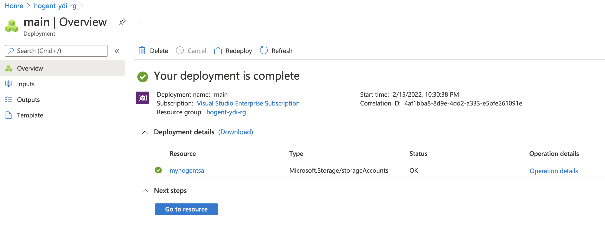
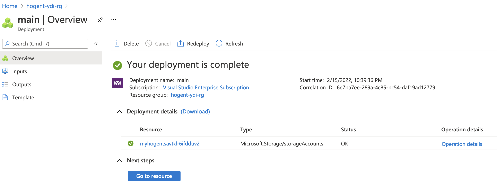

# Module 5: BICEP Deep Dive

## Exercise: Create and deploy Azure Bicep templates by using Visual Studio Code

For your website, you decide to first create a proof of concept by creating a basic Bicep template. In this exercise, you'll create a storage account. Later, you'll modify the template to make it more reusable.

During the process, you'll:

1. Create a template that defines a single storage account resource that includes hard-coded values.
1. Provision your infrastructure and verify the result.
1. Provision the infrastructure again to see the new resource.

### Prerequisites

- An Azure account with an active subscription. If you don't already have one, ask your instructor.
- [Visual Studio Code](https://code.visualstudio.com/) with the [Bicep extension](https://marketplace.visualstudio.com/items?itemName=ms-azuretools.vscode-bicep) installed.
- [PowerShell 7.0+](https://docs.microsoft.com/en-us/powershell/scripting/install/installing-powershell?view=powershell-7.2) installed locally
- [Azure PowerShell module](https://www.powershellgallery.com/packages/Az/7.2.0) installed locally

This exercise uses the Bicep extension for Visual Studio Code. Be sure to install this extension in Visual Studio Code.

## Useful links
- [Azure Bicep Syntax](https://docs.microsoft.com/en-us/azure/azure-resource-manager/bicep/file)
- [Azure ARM Resource definitions](https://docs.microsoft.com/en-us/azure/templates/)

### Create a Bicep template that contains a storage account

1. Open Visual Studio Code.
2. Create a new file called main.bicep.
3. Save the empty file so that Visual Studio Code loads the Bicep tooling.
  You can either select File > Save As or select Ctrl+S in Windows (⌘+S on macOS). Be sure to remember where you've saved the file. For example, you might want to create a templates folder to save it in.

4. Add the following content into the file. You'll deploy the template soon. It's a good idea to type this in yourself instead of copying and pasting, so that you can see how the tooling helps you to write your Bicep files. Notice that Visual Studio Code automatically suggests property names as you type. The Bicep extension for Visual Studio Code understands the resources you're defining in your template, and it lists the available properties and values that you can use.

```bicep
resource storageAccount 'Microsoft.Storage/storageAccounts@2019-06-01' = {
  name: 'myhogentsa'
  location: 'westeurope'
  sku: {
    name: 'Standard_LRS'
  }
  kind: 'StorageV2'
  properties: {
    accessTier: 'Hot'
  }
}
```

> 💡 Bicep is strict about where you put line breaks, so make sure you don't put line breaks in different places than what's listed here.


5. Update the name of the storage account from myhogentstorage to something that's likely to be unique. Make sure the name is all lowercase, without any special characters, and fewer than 24 characters.
6. Save the changes to the file.

### Deploy the Bicep template to Azure

To deploy this template to Azure, sign in to your Azure account from the Visual Studio Code terminal.

1. Open a Visual Studio Code terminal window by selecting Terminal > New Terminal. The window usually opens at the bottom of the screen.
2. If the dropdown control at the right displays pwsh or PowerShell, you have the right shell to work from, and you can skip to the next section.

If pwsh or PowerShell isn't displayed, select the dropdown control, choose Select Default Shell, and then select pwsh or PowerShell.

3. Select the plus sign (+) in the terminal to create a new terminal with pwsh or PowerShell as the shell.
4. You might have to switch your terminal to the directory where you saved your template. For example, if you saved it to the templates folder, you can use this command:

```powershell
cd templates
```

### Install the Bicep CLI

To use Bicep from Azure PowerShell, [install the Bicep CLI](https://docs.microsoft.com/en-us/azure/azure-resource-manager/templates/bicep-install?tabs=azure-powershell#install-manually).

### Sign in to Azure by using Azure PowerShell

1. In the Visual Studio Code terminal, run the following command:

```powershell
Connect-AzAccount
```

A browser opens so that you can sign in to your Azure account.

2. After you've signed in to Azure, the terminal displays a list of the subscriptions associated with this account.

3. Set the default subscription for all of the Azure PowerShell commands that you run in this session.

```powerShell
$context = Get-AzSubscription -SubscriptionName 'Name of the subscription'
Set-AzContext $context
```

> ⚠️ If you've used more than one subscription recently, the terminal might display more than one subscriptions. In this case, use the next two steps to set one as the default subscription. If the preceding command was successful, and only one subscription is listed, skip the next two steps.

4. Get the subscription ID. Running the following command lists your subscriptions and their IDs. Look for the instructor's subscription, and then copy the ID from the second column. It looks something like cf49fbbc-217c-4eb6-9eb5-a6a6c68295a0.

```PowerShell
Get-AzSubscription
```

5. Change your active subscription to the instructor's subscription. Be sure to replace {Your subscription ID} with the one that you copied.

```PowerShell
$context = Get-AzSubscription -SubscriptionId <Your-subscription-ID>
Set-AzContext $context
```

### Create resource group

```powershell
New-AzResourceGroup -Name "hogent-<yourname>-rg" -Location "westeurope"
```

### Deploy the template to Azure

Deploy the template to Azure by using the following Azure PowerShell command in the terminal. This can take a minute or two to complete, and then you'll see a successful deployment.

```PowerShell
New-AzResourceGroupDeployment -TemplateFile main.bicep -ResourceGroupName "hogent-<yourname>-rg"
```

### Verify the deployment

The first time you deploy a Bicep template, you might want to use the Azure portal to verify that the deployment has finished successfully and to inspect the results.

1. Go to the [Azure portal](https://portal.azure.com/) and make sure you're in the subscription:
2. Select your avatar in the upper-right corner of the page.
3. Select Switch directory. In the list, choose the instructor's directory.
4. On the left-side panel, select Resource groups.
5. Select your resource group name.
6. In Overview, you can see that one deployment succeeded.

7. Select 1 Succeeded to see the details of the deployment.

8. Select the deployment called main to see what resources were deployed, and then select Deployment details to expand it. In this case, there's one storage account with the name that you specified.

9. Leave the page open in your browser. You'll check on deployments again later.

You can also verify the deployment from the command line. To do so, run the following Azure PowerShell command:

```poweshell
Get-AzResourceGroupDeployment -ResourceGroupName "hogent-<yourname>-rg" | Format-Table
```

### Add the location and resource name parameters

1. In the main.bicep file in Visual Studio Code, add the following code to the top of the file:

```bicep
param location string = resourceGroup().location
param storageAccountName string = 'myhogentsa${uniqueString(resourceGroup().id)}'
```

As you type, the Bicep linter adds yellow squiggly lines underneath each of the parameter and variable names to indicate they're not currently used. You'll fix this soon.

Notice that you're using expressions that include string interpolation, the ```uniqueString()``` function, and the ```resourceGroup()``` function to define default parameter values. Someone deploying this template can override the default parameter values by specifying the values at deployment time, but they can't override the variable values.

2. Find the places within the resource definitions where the location and name properties are set, and update them to use the parameter values. After you're finished, the resource definitions within your Bicep file should look like this:

```bicep
resource storageAccount 'Microsoft.Storage/storageAccounts@2019-06-01' = {
  name: storageAccountName
  location: location
  sku: {
    name: 'Standard_LRS'
  }
  kind: 'StorageV2'
  properties: {
    accessTier: 'Hot'
  }
}
```

3. Save the changes to the file.

### Automatically set the SKUs for each environment type

1. In the main.bicep file in Visual Studio Code, add the following Bicep parameter below the parameters that you created in the previous task:

```bicep
@allowed([
  'nonprod'
  'prod'
])
param environmentType string
```

Notice that you're defining a parameter with a set of allowed values, but you're not specifying a default value for this parameter.

2. Below the line that declares the appServicePlanName variable, add the following variable definitions:

```bicep
var storageAccountSkuName = (environmentType == 'prod') ? 'Standard_GRS' : 'Standard_LRS'
```

Notice that you're setting these variables' values by using the ternary operator to express some if/then/else logic.

3. Find the places within the resource definitions where the sku properties are set, and update them to use the parameter values. After you're finished, the resource definitions in your Bicep file should look like this:

```bicep
resource storageAccount 'Microsoft.Storage/storageAccounts@2019-06-01' = {
  name: storageAccountName
  location: location
  sku: {
    name: storageAccountSkuName
  }
  kind: 'StorageV2'
  properties: {
    accessTier: 'Hot'
  }
}
```

Notice that you haven't parameterized everything. You've set some properties right in the resource definitions where you know these aren't going to change between deployments.

4. Save the changes to the file.

### Deploy the updated Bicep template

Run the following Azure PowerShell command in the terminal. This is similar to the command you ran before.

```PowerShell
New-AzResourceGroupDeployment `
  -ResourceGroupName "hogent-<yourname>-rg" `
  -TemplateFile main.bicep `
  -environmentType nonprod
```

Notice that you're explicitly specifying the value for the ```environmentType``` parameter when you execute the deployment. You don't need to specify all of the other parameter values because they have defaults that make sense.

### Check your deployment

1. In your browser, go back to the Azure portal. Go to your resource group. You'll still see one successful deployment, because the deployment used the same name as the first deployment
2. Select the 1 Succeeded link
3. Select the deployment called main, and then select Deployment details to expand the list of deployed resource.



4. Notice that the resource have been deployed with new, randomly generated names.

